<picture>
  <source media="(max-width: 359px)" srcset="assets/profile-narrow.svg">
  <source media="(max-width: 1099px)" srcset="assets/profile-compact.svg">
  
</picture>

  
  
  <picture></picture>

