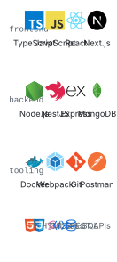

<picture>
  <source media="(prefers-color-scheme: dark)" srcset="assets/header-dark.svg">
  
</picture>

Full-stack applications for e-commerce, physical access control, and business operations.

## Domain expertise

**E-commerce** Online storefronts, catalogs, and order workflows.

**Physical access control** Interfaces and services for physical access management.

**Business systems & integrations** Internal applications, API integrations, and workflow automation.

## Technical stack

<picture>
  <source media="(prefers-color-scheme: dark)" srcset="assets/stack-dark.svg">
  
</picture>

---

Get in touch · [Telegram ↗](https://t.me/anb_dev) · [Email ↗](mailto:Andrey1593@bk.ru)
